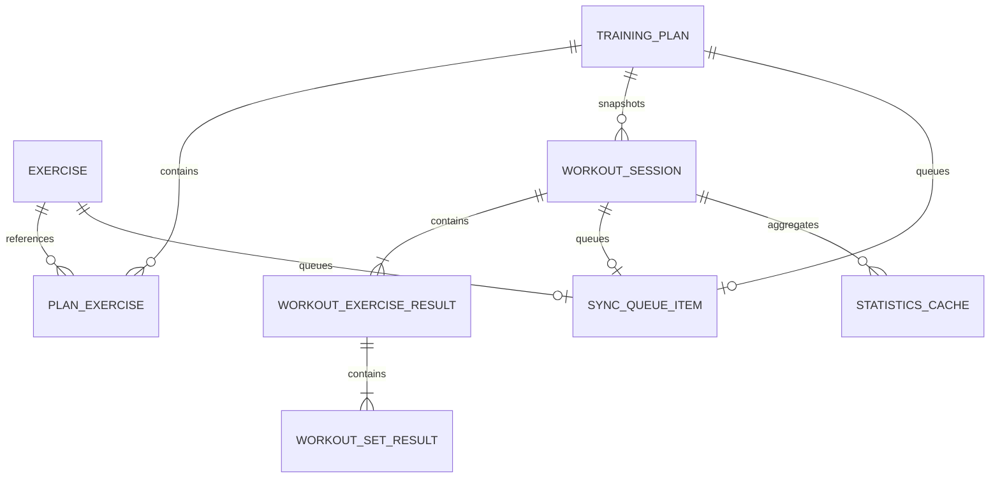

# Forge PWA MVP 产品契约

| 项目 | 内容 |
|---|---|
| 任务 | T00 冻结产品契约 |
| 状态 | Frozen |
| 版本 | 1.0 |
| 冻结日期 | 2026-07-14 |
| 产品基线 | [`forge-pwa-prd.md`](../prd/forge-pwa-prd.md) |
| 设计基线 | [`forge-mvp-product-interface`](../figma-make/forge-mvp-product-interface/) |
| 执行基线 | [`forge-mvp-execution-plan.md`](./forge-mvp-execution-plan.md) |

本文档只冻结 MVP 行为和跨任务契约，不替代各任务的实现设计。后续发现契约错误时，应建立独立修正任务，不在功能任务中隐式修改。

## 1. MVP 决策表

| 编号 | 主题 | 冻结决策 | 后续影响 |
|---|---|---|---|
| D01 | 每日多场训练 | 每个有效计划按星期与可选本地时间生成一个独立场次；同日命中多个计划即展示多场 | T02、T11 |
| D02 | 计划类别 | 类别属于计划，取值为 `strength`、`cardio`、`mobility`，默认 `strength` | T02、T05、T11 |
| D03 | 日程实例 | 今天及未来的未开始场次由计划与本地日期派生，不预先批量落库；稳定键为 `planId:YYYY-MM-DD`；过去日期只以已创建会话为事实，计划修改不得改写过去日程 | T02、T06、T11 |
| D04 | 星期语义 | 使用用户设备本地时区，星期一至星期日映射为 `1...7`；跨时区不追溯改写历史 | T02、T11、T12 |
| D05 | 计划生命周期 | 业务状态为草稿、有效、归档；删除使用 tombstone；同步状态与业务状态正交 | T02、T05、T13 |
| D06 | 重量存储 | 目标值与每组实际值均保存录入数值和 `kg`/`lb` 单位快照，不因设置变更改写历史 | T02、T05、T07、T09 |
| D07 | 自重语义 | 自重单独标记；可选附加重量同样保存数值和单位快照；不引入用户体重 | T02、T07、T10 |
| D08 | 单位切换 | 设置只决定新建目标的默认单位和编辑控件的默认展示；历史按快照展示，统计聚合时统一换算为 kg | T02、T10、T12 |
| D09 | PR | 次数型动作的 PR 是已完成组中的最大外加重量；纯自重组无重量 PR；自重附重以附加重量参与 PR | T10 |
| D10 | 训练量 | 每个已完成次数组为外加重量 × 实际次数，先换算为 kg 再求和；纯自重、时间型、跳过组不计重量 | T09、T10 |
| D11 | 连续训练 | 按本地自然日统计至少一场已完成训练的连续天数；同日多场只记一天 | T10 |
| D12 | 训练频率 | 周/月次数按已完成会话数计算；取消或未完成会话不计入 | T10 |
| D13 | 同步边界 | 定义可替换 REST Transport；无真实服务端时 T13 以 Mock Transport 和契约测试交付，不宣称真实多端同步通过 | T03、T13、T15 |
| D14 | 冲突策略 | MVP 只检测并展示实体级冲突，不做字段级自动合并；用户可保留本地版本后重试，或接受远端版本 | T13 |
| D15 | 通知 | 通知为可选增强；拒绝或不支持时保留站内计时和提醒，不阻塞训练 | T08、T12 |
| D16 | 目标浏览器 | 发布时最新两个主版本的 Chrome、Edge、Safari，以及 iOS Safari 16.4+；其他现代浏览器尽力支持 | T14、T15 |
| D17 | iOS 通知 | iOS 仅对已添加到主屏且系统支持的环境提供通知申请；否则显示兼容性说明与站内降级 | T12、T15 |
| D18 | 桌面布局 | 桌面保证完整可用并限制内容最大宽度；不照搬 Figma 固定手机外框，也不新增桌面专属信息架构 | T04、T15 |
| D19 | 原型占位入口 | 意见反馈、数据导出不属于 MVP；入口不展示。备份与同步改为同步状态/队列入口 | T04、T12、T13 |
| D20 | 用户身份 | MVP 为单设备、单本地用户，不实现账号、头像编辑或鉴权 UI；未来 HTTP Transport 的认证不纳入本期 | T04、T13 |
| D21 | 计划修改生效时间 | 星期、时间或类别的修改从用户本地当天起作用；既有 `draft/active/paused/completed/cancelled` 会话均保留创建时快照 | T02、T05、T11 |
| D22 | 草稿保存 | 新建或编辑未提交时不静默持久化；离开脏表单时提供“保存草稿、丢弃、继续编辑”，草稿不生成日程 | T05 |

## 2. 路由与导航契约

| 路径 | 页面 | 入口 | 返回/刷新行为 | 底部导航 |
|---|---|---|---|---|
| `/` | Dashboard | 首页标签、启动页 | 刷新保留所选本周数据；默认聚焦今天 | 首页高亮 |
| `/plans` | 计划列表 | 计划标签 | 刷新保留分页查询，不要求保留展开项 | 计划高亮 |
| `/plans/new` | 新建计划 | 计划页新增 | 成功后替换为 `/plans/:planId`；未保存返回需确认 | 隐藏 |
| `/plans/:planId` | 编辑计划 | 计划详情“编辑计划” | 不存在或已删除显示可返回错误态；未保存返回需确认 | 隐藏 |
| `/training/start` | 创建训练会话 | 计划场次“开始训练” | 创建成功后替换为 `/training/:sessionId`；重复请求返回既有会话 | 隐藏 |
| `/training/:sessionId` | 训练执行 | 开始、继续、刷新恢复 | 刷新恢复当前动作、组和计时状态；退出需确认暂停或取消 | 隐藏 |
| `/history` | 历史列表 | 记录标签默认页 | 分页游标稳定；离线读取本地历史 | 记录高亮 |
| `/history/:sessionId` | 历史详情 | 历史条目 | 使用完成时快照；计划后续变化不影响内容 | 隐藏 |
| `/statistics` | 统计 | 记录页分段“数据统计” | 保留统计范围选择；显示更新时间与缓存范围 | 记录高亮 |
| `/settings` | 设置 | 我的标签 | 设置即时本地持久化 | 我的高亮 |

| 导航规则 | 冻结行为 |
|---|---|
| 浏览器返回 | 与页面返回按钮一致；弹层优先关闭弹层，再离开页面 |
| 深链接 | 上述所有路径均可直接打开和刷新，不依赖内存导航状态 |
| 未知路径 | 显示轻量 404，并提供返回 Dashboard |
| 训练全屏壳 | 训练开始、执行及完成总结隐藏底部导航，避免误离开 |
| 历史/统计分段 | 分段切换使用正式 URL，不只使用组件内状态 |

## 3. 实体关系与字段语义



| 实体/值对象 | 必要语义 |
|---|---|
| `TrainingPlan` | 名称、描述、业务状态、类别、星期集合、可选本地时间、日程生效本地日期、同步元数据及 tombstone |
| `PlanExercise` | 计划、动作、稳定排序位置、目标组数、次数/时长目标、重量目标、组间休息 |
| `WeightValue` | `mode: external \| bodyweight`；外加或附加重量使用正数 `value` 与 `unit: kg \| lb`；纯自重无数值 |
| `WorkoutSession` | 来源计划、日程稳定键、计划名与单位等快照、状态、开始/结束时间、当前动作/组、幂等键 |
| `WorkoutExerciseResult` | 动作名称、类型、目标、顺序和重量语义的完整快照 |
| `WorkoutSetResult` | 组号、实际次数/时长、实际重量快照、完成时间、跳过标记；提交幂等键唯一 |
| `WorkoutTimerState` | 目标秒数、运行区段开始时间、累计秒数、暂停状态；显示时间由绝对时间计算 |
| `AppSettings` | 默认重量单位、训练提醒、休息提醒、提醒提前量、通知权限观测状态、Schema 版本 |
| `StatisticsCache` | 统计范围、起止时间、生成时间、来源、核心指标；缓存结果可由历史重算 |
| `SyncQueueItem` | 实体、操作、payload、幂等键、去重键、优先级、尝试次数、下次尝试时间和状态 |

| 数据约束 | 规则 |
|---|---|
| 计划名 | 去除首尾空白后 1–80 字符 |
| 动作名 | 去除首尾空白后 1–80 字符 |
| 星期 | 有效计划至少选择一天；草稿允许为空 |
| 目标组数 | 整数 1–99 |
| 目标次数 | 次数型整数 1–999 |
| 目标时长 | 时间型整数 1–86,400 秒；UI 默认以 30 秒步进但不限制迁移数据必须为 30 的倍数 |
| 组间休息 | 整数 0–3,600 秒 |
| 重量 | 最大三位小数且大于 0；纯自重不以 `0` 冒充重量值 |
| 排序 | `position` 在同计划内唯一且可稳定排序；重排作为一次计划原子写入 |
| 历史 | 完成后保存快照，不通过当前计划或动作回填展示字段 |

## 4. 状态矩阵

### 4.1 计划

| 业务状态 | 可编辑 | 可生成日程 | 可开始训练 | 用户可见行为 |
|---|---:|---:|---:|---|
| `draft` | 是 | 否 | 否 | 显示草稿，可继续编辑或删除 |
| `active` | 是 | 是 | 是 | 正常显示和生成日程 |
| `archived` | 否 | 否 | 否 | 默认列表隐藏，可在归档筛选查看和恢复 |
| 已删除 tombstone | 否 | 否 | 否 | 列表隐藏，仅保留到同步确认和清理完成 |

同步状态 `local/pending/processing/failed/conflict/synced` 独立叠加；同步失败或冲突不会自动改变计划业务状态。

### 4.2 训练会话

| 当前状态 | 允许操作 | 下一状态 | 非法示例 |
|---|---|---|---|
| `draft` | 开始、取消 | `active`、`cancelled` | 完成组、暂停 |
| `active` | 完成组、暂停、完成、取消 | `active`、`paused`、`completed`、`cancelled` | 再次开始新会话 |
| `paused` | 恢复、完成、取消 | `active`、`completed`、`cancelled` | 运行计时器 |
| `completed` | 查看总结 | 无 | 再提交组、恢复 |
| `cancelled` | 查看取消结果 | 无 | 恢复、完成 |

| 幂等规则 | 行为 |
|---|---|
| 创建会话 | 同一 `scheduleOccurrenceKey` 若存在 `draft/active/paused/completed` 会话，返回既有会话；取消后允许显式重开并生成新幂等键 |
| 完成组 | `sessionId + exerciseResultId + setNumber` 唯一；重复点击或网络重放返回原结果 |
| 完成会话 | 首次事务性写入完成时间和历史快照；重复请求返回相同完成结果 |

### 4.3 日程派生状态

| 状态 | 判定 |
|---|---|
| `rest` | 当天无有效计划命中 |
| `planned` | 有派生场次且全部未开始 |
| `in_progress` | 至少一场为 `active` 或 `paused`，且无完成场次 |
| `partially_completed` | 同日多场中至少一场完成，且仍有计划中或进行中场次 |
| `completed` | 当天所有派生或已开始场次均完成 |

取消场次不计完成；若同日无其他场次，则当天回到 `planned`，并允许重开。

### 4.4 同步、网络、通知与 PWA

| 对象 | 状态 | 用户反馈/行为 |
|---|---|---|
| 同步项 | `pending` | 显示待同步计数，可继续离线操作 |
| 同步项 | `processing` | 显示同步中，不阻塞本地读取 |
| 同步项 | `failed` | 显示失败和下次重试；允许手动重试 |
| 同步项 | `conflict` | 显示冲突入口，停止该项自动重试，等待用户选择 |
| 同步项 | `synced` | 队列项移除，实体记录远端版本和同步时间 |
| 网络 | `online` | 正常请求；若有队列则触发调度 |
| 网络 | `offline` | 所有支持写入先本地提交并排队 |
| 网络 | `recovering` | 网络事件恢复后等待一次连通性确认，再处理队列 |
| 通知 | `not_requested` | 只在用户启用提醒的明确操作中申请权限 |
| 通知 | `granted` | 允许系统提醒，同时保留站内提醒 |
| 通知 | `denied` | 解释如何在系统设置恢复，仅使用站内提醒 |
| 通知 | `unsupported` | 展示兼容性说明，仅使用站内提醒 |
| PWA | `installable` | 在非打扰位置提供安装入口 |
| PWA | `installed` | 隐藏安装入口 |
| PWA | `update_available` | 显示更新横幅，由用户确认后激活并刷新 |
| PWA | `offline_ready` | 可从缓存启动 App Shell 并读取最近本地数据 |

## 5. Figma 可见入口与交互矩阵

| 页面/入口 | 冻结行为 | 空/失败/离线处理 |
|---|---|---|
| 周日历日期 | 选择日期并滚动至对应日程；默认今天 | 无场次显示休息日 |
| 通知铃铛 | 打开提醒状态面板；不直接申请系统权限 | 离线仍可查看本地提醒；无提醒显示空态 |
| 计划中场次“开始训练” | 经 `/training/start` 幂等创建或恢复会话 | 计划已失效时提示并返回 Dashboard |
| 进行中场次“继续训练” | 打开对应会话而非新建 | 本地会话缺失时显示可恢复错误 |
| 已完成场次 | 打开历史详情，不显示开始按钮 | 历史缺失时显示数据异常 |
| 场次更多按钮 | MVP 仅提供计划中场次的“跳转编辑计划”；不提供临时改期或删除单次场次 | 不适用项隐藏而非无响应 |
| 计划卡片 | 展开动作摘要 | 分页失败保留已加载项并提供重试 |
| 编辑计划 | 进入 `/plans/:planId`，支持名称、星期、类别、时间和动作管理 | 冲突时只读展示冲突入口 |
| 新建计划 | 名称和至少一个动作有效后可保存；保存为有效计划 | 离线本地保存并标记待同步 |
| 未提交计划返回 | 脏表单弹出保存草稿、丢弃、继续编辑；草稿不生成日程 | 草稿仅本地保存也进入同步队列 |
| 动作弹层 | 新增/编辑/删除次数型或时间型动作 | 非法字段禁用提交并显示字段错误 |
| 动作排序 | 使用明确拖动手柄；键盘提供上移/下移 | 原子保存失败恢复原顺序 |
| 删除计划 | 二次确认；有进行中会话时禁止删除并引导处理会话 | 离线写入 tombstone 并排队 |
| 完成本组 | 单击只提交当前组一次，成功后进入休息或下一组 | 保存失败停留当前组并可重试 |
| 训练关闭 | 弹出继续、暂停退出、取消训练；取消需二次确认 | 暂停结果立即本地持久化 |
| 时间型暂停/继续 | 暂停不累计；恢复以绝对时间继续计算 | 刷新按持久化时间状态恢复 |
| 时间型提前结束 | 二次确认后记录实际时长并完成当前组，不等同于取消整场 | 实际时长必须大于 0 |
| 时间型达到目标 | 触发站内提示；有权限时补充系统通知；用户确认完成当前组 | 无通知权限不影响完成 |
| 时间型超时继续 | 达标后不自动截断；用户可继续，实际时长按最终确认记录 | UI 明确显示已超出目标 |
| 训练完成 | 最后一组后进入完成确认与总结，再事务性完成 | 重复确认返回同一总结 |
| 历史记录条目 | 进入正式历史详情页；详情使用训练快照 | 空列表提供创建/开始计划入口 |
| 训练记录/数据统计分段 | 在 `/history` 与 `/statistics` 间导航 | 统计离线时展示缓存范围和更新时间 |
| 重量单位 | 切换新录入默认单位，不改写历史快照 | 本地即时保存 |
| 休息提醒 | 用户开启时按需申请通知权限 | 拒绝或不支持时启用站内降级 |
| 训练提醒 | 在设置页配置开关和提前分钟数 | 无计划时间时解释无法调度系统提醒 |
| 备份与同步 | 打开同步状态、失败和冲突管理入口 | 无真实 Transport 时标注“本地模式” |
| 安装入口 | 仅在可安装状态展示；iOS 显示手动添加到主屏说明 | 不支持安装时隐藏 |
| 更新横幅 | 用户确认后激活等待中的 Service Worker 并刷新 | 未确认前继续当前版本 |
| 用户资料卡 | MVP 显示本地默认用户，不可编辑 | 不依赖网络 |
| 数据导出、意见反馈 | MVP 不展示 | 不保留无响应占位入口 |

## 6. 数据与用例接口契约

| 领域 | 用例接口 | 关键输入/输出约束 |
|---|---|---|
| 计划 | `listPlansPage(cursor, limit, filter)` | 稳定游标；默认排除归档和 tombstone |
| 计划 | `getPlan(planId)` | 返回计划及排序后的动作；不存在使用统一 `not_found` 错误 |
| 计划 | `createPlan(command)` | 单次事务保存计划、动作和同步项 |
| 计划 | `updatePlan(command, expectedVersion)` | 乐观版本检查；冲突不覆盖本地未决编辑 |
| 计划 | `archivePlan(planId)` / `deletePlan(planId)` | 有进行中会话时返回 `active_session_exists` |
| 日程 | `listSchedule(range)` | 由有效计划、日期和既有会话派生，不预写未来场次 |
| 会话 | `startSession(planId, localDate, idempotencyKey)` | 返回新建或已存在会话，包含完整计划快照 |
| 会话 | `transitionSession(sessionId, command)` | 纯状态机校验后原子持久化 |
| 训练组 | `completeSet(command, idempotencyKey)` | 重复键返回原结果，不新增第二组 |
| 计时 | `saveTimerState(sessionId, timerState)` | 保存绝对开始时间与累计时长，不以 interval tick 为事实 |
| 历史 | `listHistoryPage(cursor, limit)` | 以完成时间倒序，游标含排序值和 id |
| 历史 | `getHistoryDetail(sessionId)` | 仅返回完成会话快照 |
| 统计 | `calculateStatistics(range, history)` | 确定性纯计算，可由历史重建 |
| 设置 | `getSettings()` / `updateSettings(patch)` | 迁移后始终返回完整默认值 |
| 同步 | `enqueueMutation(entity, operation)` | 同实体同操作使用去重键保留最新 payload；训练组幂等键不可合并丢失 |

| 统一错误码 | 含义 | UI 行为 |
|---|---|---|
| `validation` | 输入不合法 | 定位字段并保留用户输入 |
| `not_found` | 实体不存在或已删除 | 显示可返回错误态 |
| `invalid_transition` | 状态转换非法 | 保留当前状态并刷新事实数据 |
| `duplicate` | 幂等操作已完成 | 当成功结果处理，不显示错误 |
| `conflict` | 版本冲突 | 进入冲突状态，不自动覆盖 |
| `storage_unavailable` | IndexedDB 不可用 | 阻止会丢数据的写入并明确告知 |
| `transport_unavailable` | 网络或服务不可用 | 本地写入成功时进入待同步，不回滚本地结果 |
| `unknown` | 未分类错误 | 提供安全重试并记录诊断信息 |

## 7. REST Transport 契约

MVP 前端只依赖以下 Transport 语义；URL 可由环境配置。真实服务端、账号认证和跨设备验收不属于当前已确认交付。

| 项目 | 契约 |
|---|---|
| 方法 | `POST /v1/sync/items` |
| 请求头 | `Content-Type: application/json`、`Idempotency-Key: <key>`；未来认证头由适配器注入 |
| 请求体 | `itemId`、`entityType`、`entityId`、`operation`、`payload`、`baseRemoteVersion`、`clientUpdatedAt` |
| 成功 | `200` 或 `201`，返回 `status: synced`、`remoteVersion`、`syncedAt` |
| 幂等重放 | 返回与首次成功相同的实体版本语义，不重复创建 |
| 冲突 | `409`，必须返回 `status: conflict`、`reason`、`remoteVersion` 和 `remotePayload`，以支持接受远端版本 |
| 暂时失败 | `408`、`429`、`5xx` 或网络错误进入指数退避 |
| 永久失败 | 其他 `4xx` 标记失败并等待用户处理，不无限自动重试 |
| 顺序 | 训练记录优先级 300；计划与动作 200；统计 100；同优先级按创建时间 |
| 小队列恢复 | 连通性确认后 10 秒内至少发起一次处理，不保证 10 秒内全部成功 |
| 冲突处理 | 接受远端时以响应中的 `remotePayload` 覆盖本地并清除队列；保留本地时以 `remoteVersion` 作为新基线和新幂等键再次提交 |

```json
{
  "itemId": "queue-id",
  "entityType": "workout-session",
  "entityId": "session-id",
  "operation": "upsert",
  "payload": {},
  "baseRemoteVersion": 3,
  "clientUpdatedAt": "2026-07-14T08:00:00.000Z"
}
```

## 8. 验收矩阵

| 领域 | 必须通过的场景 | 主要验证任务 |
|---|---|---|
| 计划 | 创建、编辑、归档、删除、动作排序、非法输入、分页、离线保存 | T01、T02、T03、T05 |
| 日程 | 单计划单场、多计划同日多场、休息日、取消后重开、跨本地日期 | T01、T02、T11 |
| 次数训练 | 单击提交、重复点击去重、重量单位快照、自重、最后一组推进、刷新恢复 | T01、T06、T07 |
| 时间训练 | 暂停不累计、刷新恢复、提前结束、达标、超时继续、休息提醒 | T01、T06、T08、T12 |
| 完成与历史 | 完成事务幂等、快照不受计划修改影响、稳定分页、离线详情 | T09 |
| 统计 | 周/月次数、连续天数、8 周趋势、最大外加重量 PR、kg 统一训练量、空态 | T10 |
| Dashboard | 默认今天、多场状态、开始/继续不超过 3 步、最近摘要、离线与待同步提示 | T11 |
| 设置/通知 | 单位持久化、按需申请、拒绝、不支持、iOS 未安装、站内降级 | T12 |
| 同步 | 优先级、去重、幂等重放、自动触发、退避、永久失败、冲突两种处理 | T13 |
| PWA | 安装能力、离线 App Shell、最近数据、用户确认更新、旧缓存清理 | T14 |
| 适配 | 手机、横屏、桌面、安全区、键盘、焦点、触控、目标浏览器矩阵 | T15 |
| 性能 | 首次可用 ≤3 秒、无网首页 ≤2 秒、恢复网络 10 秒内发起同步 | T15 |

## 9. 浏览器能力与降级矩阵

| 能力 | Chrome/Edge 最新两版 | Safari 最新两版 | iOS Safari 16.4+ | 降级 |
|---|---|---|---|---|
| IndexedDB 本地读写 | 必须 | 必须 | 必须 | 不可用时阻止关键写入并告知 |
| Service Worker/离线启动 | 必须 | 必须 | 必须 | 在线模式提示，不宣称离线可用 |
| 安装提示事件 | 支持时使用 | 不依赖事件 | 显示手动添加到主屏 | 提供兼容性说明或隐藏入口 |
| 系统通知 | 支持时可用 | 支持时可用 | 仅已安装且获授权时可用 | 始终保留站内提醒 |
| 后台同步 API | 不作为依赖 | 不作为依赖 | 不作为依赖 | 以前台网络恢复、启动和手动重试调度 |

## 10. T00 验收记录与风险

| 门禁项 | 结果 |
|---|---|
| 范围核对 | 通过；仅新增产品契约文档，不包含代码、Schema 或 UI 实现 |
| 决策表 | 通过；重量、日程、统计、同步、通知、浏览器和占位入口均已冻结 |
| 路由表 | 通过；所有正式路由具备入口、返回、刷新和导航行为 |
| 实体关系 | 通过；计划、动作、会话、结果、统计和同步关系已定义 |
| 状态矩阵 | 通过；计划、会话、日程、同步、网络、通知和 PWA 状态无未决项 |
| 交互矩阵 | 通过；Figma 可见入口均有行为或明确移出 MVP |
| API/Transport | 通过；前端用例边界及可替换 REST Transport 已定义 |
| 验收矩阵 | 通过；后续任务的核心行为均可映射到验证任务 |
| 设计核对 | 通过；保留视觉与主交互，移除原型的无响应占位入口和固定桌面手机框 |
| 数据兼容 | 未执行；T00 不变更 Schema，v1→v2 默认值与迁移由 T02 实现 |
| 用户许可 | 已获得执行请求中的适用测试许可；T00 仅执行文档静态验证，不运行构建或编译 |

| 风险 | 当前处置 | 阻塞性 |
|---|---|---|
| 真实同步服务端与认证未提供 | 以 REST 契约和 Mock Transport 验证边界，真实多端同步保持未验收 | 不阻塞 T01–T14；阻止宣称真实多端同步 |
| iOS 安装与通知能力受系统环境影响 | 冻结最低版本和站内降级，T15 使用真机或等效环境记录 | 不阻塞开发 |
| 不保存用户体重导致纯自重不计训练量 | 已作为 MVP 统计口径明确记录 | 不阻塞；若改变需独立契约修正任务 |
| 远程字体无法离线 | T04 本地化字体，T14 纳入预缓存 | 不阻塞 T00 |
| Figma 无完整 PWA 状态画面 | 以本契约的状态和反馈行为为产品基线，视觉由 T04/T11/T14落地 | 不阻塞 T00 |
